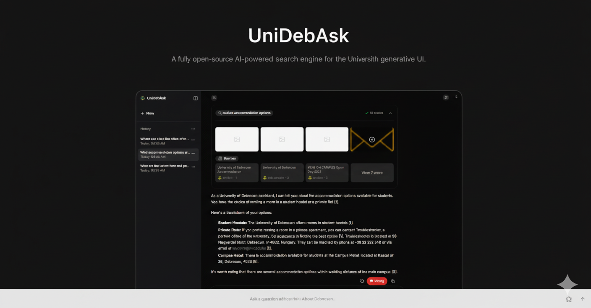

# UniDebAsk

<div align="center">
  

  <p align="center">
    <strong>A fully open-source AI-powered search engine for the University of Debrecen generative UI.</strong>
  </p>

  <p align="center">
    <a href="#features">Features</a> •
    <a href="#how-it-works">How It Works</a> •
    <a href="#getting-started">Getting Started</a> •
    <a href="#tech-stack">Tech Stack</a> •
    <a href="#deployment">Deployment</a>
  </p>
</div>

---

## 🎯 Overview

UniDebAsk is an intelligent search engine specifically designed for the University of Debrecen (UniDeb) community. It combines the power of **RAG** (Retrieval-Augmented Generation) with modern AI models to provide accurate, contextual answers to student and faculty questions.

Built with **Next.js 15**, **React 19**, and the **Vercel AI SDK**, UniDebAsk delivers real-time streaming responses with a beautiful, responsive UI.

## ✨ Features

### Core Capabilities
- 🤖 **AI-Powered Search** - Self-hosted AI model with support for multiple providers (Anthropic, Google, Groq, etc.)
- 🔍 **RAG Implementation** - Context-aware answers using retrieval-augmented generation
- 💬 **Real-time Streaming** - See responses as they're generated
- 🎨 **GenerativeUI** - Dynamic UI components based on query type
- 📚 **Chat History** - Save and revisit previous conversations (auth required)
- 🔐 **Secure Authentication** - User-specific chat history with Supabase
- 🌓 **Dark/Light Mode** - Beautiful themes for any preference
- 📱 **Responsive Design** - Works seamlessly on mobile and desktop

### Advanced Features
- 🚩 **Wrong Answer Flagging** - Report incorrect responses to improve accuracy
- 🔄 **Message Regeneration** - Regenerate responses with different models
- ✏️ **Message Editing** - Edit and resend questions
- 📊 **Question Tracking** - Track all questions asked in Supabase
- 🎯 **Model Selection** - Choose from multiple AI models and topics
- 🔊 **Status Indicators** - Visual feedback (Thinking, Searching, Analyzing...)

## 🔄 How It Works

Here's the complete flow from user question to final answer:

```
┌─────────────────────────────────────────────────────────────────┐
│                         USER JOURNEY                             │
└─────────────────────────────────────────────────────────────────┘

1. USER ASKS QUESTION
   │
   ├─► User types: "What are the admission requirements for CS?"
   │
   └─► Selects AI model (optional) & topic (optional)

2. AUTHENTICATION CHECK
   │
   ├─► Authenticated? → Track question in Supabase
   │
   └─► Anonymous? → Process but don't save history

3. RAG PROCESSING
   │
   ├─► Query Analysis
   │   └─► Determine query intent & extract keywords
   │
   ├─► Retrieval Phase
   │   ├─► Search UniDeb knowledge base
   │   ├─► Fetch relevant documents/sources
   │   └─► Web search (if needed via Tavily/Exa)
   │
   └─► Context Building
       └─► Compile relevant context for AI

4. AI GENERATION
   │
   ├─► Send to selected AI model with context
   │   └─► Self-hosted model, Anthropic, Google, Groq, etc.
   │
   ├─► Stream response in real-time
   │   └─► User sees: "Thinking..." → "Searching..." → Answer
   │
   └─► Generate related questions (optional)

5. RESPONSE DELIVERY
   │
   ├─► Display answer with sources
   │
   ├─► Show related questions
   │
   └─► Enable actions:
       ├─► 🔄 Regenerate
       ├─► ✏️ Edit question
       ├─► 📋 Copy answer
       ├─► 🚩 Flag if wrong
       └─► 🔗 Share (if enabled)

6. POST-PROCESSING
   │
   ├─► Save to Redis (if chat history enabled)
   │   └─► user:v2:chat:{userId} → chat:{chatId}
   │
   ├─► Track in Supabase
   │   ├─► questions table (all questions)
   │   └─► wrong_answers table (if flagged)
   │
   └─► Update chat history sidebar
```

### Technical Flow Diagram

```
┌──────────┐     ┌──────────┐     ┌──────────┐     ┌──────────┐
│  Client  │────►│   API    │────►│   RAG    │────►│    AI    │
│  (Next)  │     │  Route   │     │  Engine  │     │  Model   │
└──────────┘     └──────────┘     └──────────┘     └──────────┘
     │                 │                 │                 │
     │                 │                 │                 │
     ▼                 ▼                 ▼                 ▼
┌──────────┐     ┌──────────┐     ┌──────────┐     ┌──────────┐
│ Supabase │     │  Redis   │     │  Tavily  │     │ Response │
│  Auth    │     │  Cache   │     │  Search  │     │ Streaming│
└──────────┘     └──────────┘     └──────────┘     └──────────┘
```

### Abbreviations Used
- **RAG**: Retrieval-Augmented Generation
- **UniDeb**: University of Debrecen
- **AI SDK**: Vercel AI SDK
- **UI**: User Interface
- **RLS**: Row Level Security (Supabase)

## 🚀 Getting Started

### Prerequisites

- **Node.js** 18+ or **Bun** (recommended)
- **Redis** (Upstash or local) for chat history
- **Supabase** account for authentication & data storage
- Self-hosted AI model or API keys for supported providers (recommended: [free Google Gemini API](https://ai.google.dev/))

### Installation

1. **Clone the repository**
   ```bash
   git clone https://github.com/purelyricky/unideb-ask.git
   cd unideb-ask
   ```

2. **Install dependencies**
   ```bash
   bun install
   # or
   npm install
   ```

3. **Set up environment variables**

   Create a `.env.local` file in the root directory:
   ```env
   # AI Provider (at least one required - self-hosted or external)
   # Get free Gemini API key at: https://ai.google.dev/
   GOOGLE_GENERATIVE_AI_API_KEY=your_google_key

   # Search Provider (required)
   TAVILY_API_KEY=your_tavily_key

   # Supabase (required for auth & tracking)
   NEXT_PUBLIC_SUPABASE_URL=your_supabase_url
   NEXT_PUBLIC_SUPABASE_ANON_KEY=your_supabase_anon_key

   # Redis (optional, for chat history)
   REDIS_URL=your_redis_url
   ENABLE_SAVE_CHAT_HISTORY=true

   # Optional Features
   NEXT_PUBLIC_ENABLE_SHARE=true
   ```

4. **Set up Supabase**

   Run the SQL schema in your Supabase dashboard:
   ```bash
   # Navigate to your Supabase project → SQL Editor
   # Copy and run the contents of: supabase-schema.sql
   ```

5. **Run the development server**
   ```bash
   bun dev
   # or
   npm run dev
   ```

6. **Open your browser**

   Navigate to [http://localhost:3000](http://localhost:3000)

## 🛠️ Tech Stack

### Frontend
- **[Next.js 15](https://nextjs.org/)** - React framework with App Router
- **[React 19](https://react.dev/)** - UI library
- **[TypeScript](https://www.typescriptlang.org/)** - Type safety
- **[Tailwind CSS](https://tailwindcss.com/)** - Styling
- **[shadcn/ui](https://ui.shadcn.com/)** - Component library

### AI & Backend
- **[Vercel AI SDK](https://sdk.vercel.ai/)** - AI streaming & GenerativeUI
- **Self-hosted AI Model** - Custom University of Debrecen model
- **[Google AI](https://ai.google.dev/)** - Gemini models (free API available)
- **[Tavily](https://tavily.com/)** - Search grounding

### Database & Auth
- **[Supabase](https://supabase.com/)** - Authentication & PostgreSQL
- **[Redis](https://redis.io/)** - Chat history storage (via Upstash)

## 📝 Scripts

```bash
# Development
bun dev              # Start dev server with Turbo
bun build            # Create production build
bun start            # Start production server

# Code Quality
bun lint             # Run ESLint + import sorting
bun typecheck        # TypeScript type checking
bun format           # Format code with Prettier
bun format:check     # Check formatting without changes
```

## 🔐 Security Features

### User Authentication
- Row Level Security (RLS) in Supabase
- User-specific chat history isolation
- Authenticated-only features (history, sharing)

### Data Protection
- Chat ownership verification
- Anonymous users cannot access authenticated chats
- Secure API routes with authentication checks

### Wrong Answer Tracking
- Users can flag incorrect responses
- Flagged answers stored in Supabase
- Question tracking for analytics (total questions asked)

## 📊 Database Schema

### Questions Table
```sql
- id: UUID (Primary Key)
- user_id: UUID (Foreign Key to auth.users)
- chat_id: TEXT
- message_id: TEXT (Unique)
- question: TEXT
- answer: TEXT
- created_at: TIMESTAMP
```

### Wrong Answers Table
```sql
- id: UUID (Primary Key)
- user_id: UUID (Foreign Key to auth.users)
- chat_id: TEXT
- message_id: TEXT
- question: TEXT
- answer: TEXT
- flagged_at: TIMESTAMP
```

## 🌐 Deployment

### Deploy to Vercel (Recommended)

[](https://vercel.com/new/clone?repository-url=https://github.com/purelyricky/unideb-ask)

1. Click the button above
2. Add environment variables
3. Deploy!

### Manual Deployment

```bash
# Build the project
bun run build

# Start production server
bun start
```

## 🤝 Contributing

We welcome contributions from the community! Whether you're fixing bugs, adding features, or improving documentation, your help is appreciated.

### Getting Started with Contributing

1. **Fork the repository**
2. **Clone your fork**
   ```bash
   git clone https://github.com/your-username/unideb-ask.git
   cd unideb-ask
   ```
3. **Install dependencies**
   ```bash
   bun install
   ```
4. **Set up your development environment**
   - For testing, you can use the **free [Google Gemini API](https://ai.google.dev/)** - no credit card required
   - Add `GOOGLE_GENERATIVE_AI_API_KEY` to your `.env.local` file
5. **Create your feature branch**
   ```bash
   git checkout -b feature/AmazingFeature
   ```
6. **Make your changes and test thoroughly**
7. **Commit your changes**
   ```bash
   git commit -m 'Add some AmazingFeature'
   ```
8. **Push to your branch**
   ```bash
   git push origin feature/AmazingFeature
   ```
9. **Open a Pull Request**

### Contribution Guidelines

- Follow the existing code style and conventions
- Run `bun lint` and `bun typecheck` before submitting
- Test your changes thoroughly
- Write clear commit messages
- Update documentation if needed

## 📄 License

This project is licensed under the MIT License - see the [LICENSE](LICENSE) file for details.

## 🙏 Acknowledgments

- Built with [Vercel AI SDK](https://sdk.vercel.ai/)
- Inspired by modern AI search engines
- Designed for the University of Debrecen community

## 📧 Contact

**Ricky - Pumpkin Eater** - [@purelyRicky](https://x.com/purelyRicky)

**Project Link**: [https://github.com/purelyricky/unideb-ask](https://github.com/purelyricky/unideb-ask)

---

<div align="center">
  Made with ❤️ for the University of Debrecen
</div>
